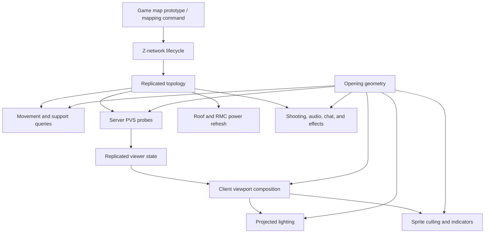

# Multi-Z Phase 2 Audit Report

## Audit boundary

This report records the static Phase 2 audit of the restored Multi-Z implementation. It freezes
the current behavior as the comparison point for later modernization; it does not claim that live
multiplayer, rendering, or performance validation has been completed.

The review covered:

- 67 C# files and 13,865 lines under `Content.CMU/{Shared,Server,Client}/ZLevels`;
- 46 current C# integration hooks outside that module: 15 client, 27 shared, and 4 server files;
- Multi-Z prototypes, the USS Bush Redux map declaration and compatibility data;
- focused unit and integration tests; and
- the content-side systems directly called by Multi-Z or subscribing to its events.

The module currently contains 64 local-event subscriptions, 15 local-event raises, 20 ECS query
enumerators, 11 spatial-query calls, and six `Update`/`FrameUpdate` entry points. These counts are
inventory signals, not proof of cost. No live profiler, GPU capture, packet capture, or
latency-injected multiplayer session was run during this static pass.

### Evidence labels

- **Definite**: the control flow or data flow proves the behavior from the audited source.
- **Needs live validation**: the mechanism exists, but its player-visible or performance impact
  must be measured.
- **Design decision**: the implementation has a clear boundary that requires an explicit gameplay
  decision rather than an inferred fix.

The canonical finding IDs and statuses are maintained in
[`audit-log.md`](audit-log.md). The IDs below refer to that log.

## Current system shape

The topology, opening geometry, vertical support, and view state are the principal seams. The
current implementation often duplicates derived data or lets presentation state stand in for a
domain policy. Later work should deepen these seams without creating one universal policy for
rendering, PVS, input, chat, and audio: those consumers have different rules even when they can
share the same geometry.

## Subsystem coverage

| Subsystem | Current implementation | Audit result and gate |
| --- | --- | --- |
| Entity visibility | Server probe eyes, viewport passes, culling, indicators, effect filters, speech and audio each select recipients or visible depths. | Defects exist in speech bubbles, visible-entity labels, lower-depth culling, remote-view recipients, and runtime viewer enablement. See MZ-004, MZ-015, MZ-017, MZ-018, MZ-032, MZ-033, MZ-042, MZ-044, MZ-049 to MZ-051, and MZ-063. |
| Rendering | `ScalingViewport` renders base, lower, upper, stair-preview, blur, weather, light, and indicator passes. | Confirmed state/context bugs exist. Per-depth CPU/GPU captures and secondary-camera tests are required before structural changes. See MZ-001, MZ-003, MZ-015, MZ-016, and MZ-032 to MZ-048. |
| Occlusion | Chunk masks find floor openings; viewport, lighting, culling, PVS, chat, and shooting apply separate LOS rules. | Shared geometry is useful, but policy must remain explicit. Gunfire skips source-deck obstruction and projected light omits receiving-map shadows. See MZ-004, MZ-019, MZ-028, MZ-042, MZ-045, and MZ-061. |
| Grid lookups | Most simulation paths treat each map entity as its grid and reuse world XY/tile indices across levels. Opening queries support intersecting grids more generally. | This is compatible with Bush's aligned single-grid levels but not moving, rotated, or multiple grids. Centralize world-position queries before expanding the supported map model. See MZ-009, MZ-010, and MZ-056. |
| Physics | Shared vertical physics owns height, velocity, falling, support probes, transfers, damage, pulling, and vehicle footprints. | Failed transfers consume the shared transition budget; the component footprint and support algorithms are too broad. See MZ-002, MZ-011 to MZ-013, MZ-026, MZ-037, MZ-038, MZ-052, MZ-056, and MZ-062. |
| Collision | Tile/high-ground support and vehicle footprints determine vertical movement; ordinary projectile simulation handles only the post-remap shot segment. | Add source-map collision characterization for cross-Z shooting and moving-grid tests before changing geometry. See MZ-009, MZ-012, MZ-028, and MZ-056. |
| Atmospherics | Each map remains an independent physical atmosphere. Fire, weather, flamer, acid, and similar effects have bespoke ground projection. | No gas, pressure, or heat flow crosses Z openings. This is a design decision, not an optimization task. See MZ-020. |
| AI pathfinding | Mobs can physically fall because base mobs carry Z physics; no navigation graph has cross-map stairs, ladders, openings, or falls. | Confirm feature-parity intent. If required, model explicit navigation edges. See MZ-021. |
| Lighting | Roof propagation supplies occlusion state; projected lighting reconstructs lower-level light through openings every frame. | The client path is large, has hidden per-ray allocations, depends on global viewport telemetry, and disables receiving-map shadows. See MZ-001, MZ-014, MZ-036, MZ-042, and MZ-061. |
| Networking | Topology is globally replicated in two dictionaries and repeated on map components. Viewer, physics, falling, and vehicle state also replicate. | Measure component counts, late-join bytes, field deltas, and topology traffic before reducing state. See MZ-008, MZ-010, MZ-017, MZ-037, MZ-038, MZ-043, MZ-049 to MZ-053, and MZ-063. |
| Prediction | Shared shooting and vehicle movement predict from replicated topology/state; authoritative support activation remains server-only. | Test vehicle edge traversal, server transition denial, immediate cross-Z shooting, late join, and reconnect under latency. See MZ-013, MZ-029, MZ-038, MZ-052, and MZ-063. |
| Entity transforms | Transfers preserve world XY between aligned maps and repair pulled/carried relationships. Viewer probes rebuild on transform events. | The aligned-world invariant is explicit. Probe rebuilds are duplicated, and viewport state is not transactionally restored. See MZ-009, MZ-026, MZ-035, MZ-048, MZ-051, and MZ-056. |
| Map loading | A lifecycle system loads all declared levels, validates them, commits topology, and initializes auxiliaries. | Returned load/validation failures roll back, but exceptions after network creation do not. Persistence and mapping-save round trips are incomplete. See MZ-006, MZ-007, MZ-022 to MZ-025, MZ-027, MZ-039, and MZ-054. |
| Grid management | Map removal repairs topology; roof and power subscribe to the resulting coarse event. | Topology updates need a precise delta and batching. See MZ-009, MZ-024, MZ-040, and MZ-056. |
| Event flow | Movement, view, topology, roof, power, projectiles, melee, and client presentation rely on local events and component lifecycle hooks. | Confirmed duplicate refreshes, broad recipient scans, coarse topology fan-out, and an unused move event exist. See MZ-014, MZ-017, MZ-018, MZ-040, MZ-050, MZ-051, and MZ-060. |
| ECS architecture | Capability, active simulation state, replicated state, presentation baseline, and caches are often colocated. | Separate only at proven seams: lifecycle/topology, process-wide opening index, per-viewport visibility snapshot, and vertical support query. See MZ-002, MZ-004, MZ-016, MZ-037, MZ-042, MZ-052, MZ-053, and MZ-059. |
| Client rendering cost | Viewport composition, lighting, culling, visual sweeps, stair preview, blur, and weather run on frame/update paths. | Instrument per viewport and per depth. Candidate counts, rays, target copies, and broad component sweeps need live captures. See MZ-001, MZ-003, MZ-015, MZ-016, MZ-036, MZ-037, and MZ-042 to MZ-048. |
| Server update cost | Falling, support, PVS polling, opening search, roof propagation, power recalculation, filters, and ordnance resolution run on server paths. | Capture tick cost with a populated Bush and under bursts. See MZ-010 to MZ-014, MZ-017 to MZ-019, MZ-040, MZ-041, MZ-045, MZ-050 to MZ-052, MZ-056 to MZ-058, and MZ-062. |

## Priority findings

### P0: correctness before architectural modernization

1. **Cross-Z gunfire bypasses source-deck obstruction — MZ-028, definite.**
   The opening search locates a floor opening but does not test projectile-equivalent collision from
   the muzzle to that opening. The shot origin is then remapped to the destination map, so a wall on
   the source deck can be bypassed. Add wall-blocked and unobstructed tests in both directions before
   changing the shot path.

2. **Impossible aim modes can suppress every shot — MZ-029, definite.**
   Look-up can remain active without an upper map, and shoot-down does not require a lower map.
   Target-map resolution then fails and the shared gun path cancels the shot. Reject or clear
   impossible modes and treat stale state defensively.

3. **Cross-Z audio has boundary and ownership defects — MZ-030 and MZ-031, definite.**
   Downward projection requires an opening on both sides of the first boundary and every deeper
   search starts from the original source position. Projection is also performed only once; cloned
   static audio is not linked to, moved with, or stopped with its source. Define boundary traversal
   once and either own the projection lifecycle or restrict the feature to one-shot audio.

4. **Three client presentation paths are provably unreachable or misaligned — MZ-032 to MZ-034,
   definite.**
   A legacy same-map guard rejects cross-Z speech bubbles after the new eligibility check; the
   visible-entity screen pass requires a temporary `ZEye` after that eye has been restored; and the
   weather stencil applies one fixed half-tile offset rather than the current pass's depth offset.

5. **Z-physics visual ownership can corrupt sprite state — MZ-037, definite.**
   Base mobs, items, structures, and vehicles inherit a networked `CMUZPhysics` component. The
   client scans all matching sprites every update and writes offset, draw depth, and rotation from a
   startup baseline. `SnapCardinals` sprites skip baseline capture but not application, so defaults
   can overwrite prototype state. Later sprite changes from other systems can also be reverted.

6. **Lifecycle rollback does not cover exceptions after commit begins — MZ-039, definite.**
   The lifecycle is transactional for returned load and validation failures. Network creation,
   component overrides, topology publication, event subscribers, and auxiliary `MapInit` calls have
   no compensating rollback if one throws. Add fault-injection coverage before claiming a fully
   transactional lifecycle.

### P1: state ownership and consistency

7. **Viewport state is process-global or incompletely restored — MZ-035, MZ-036, and MZ-048.**
   Multi-pass rendering restores the eye but not `ClearColor` and lacks `try/finally`. Projected
   lighting consumes static debug statistics that any viewport can overwrite or reset. Lower-render
   grace is keyed only by time and depth, allowing it to cross eye/map changes. Make render state
   viewport-keyed and restore mutations transactionally.

8. **Culling, lighting, and viewport composition independently derive visibility — MZ-015 and
   MZ-042.**
   Two opening caches exist per process and are invalidated together. Client composition,
   projected lighting, and sprite culling independently query/filter openings. Culling additionally
   reuses the current deck's openings for all lower decks and owns `Sprite.Visible`. Replace these
   duplicated derivations with one per-viewport, per-depth visibility snapshot; keep domain-specific
   PVS/input/chat/audio policy outside it.

9. **Secondary cameras do not have a complete render context — MZ-044.**
   Surveillance and RMC camera viewports opt into Multi-Z, while projected lighting and culling
   derive state from the local player and global eye bounds. Either prepare these systems per
   viewport or explicitly disable the unsupported features for secondary views.

10. **Parallax suppression ignores per-viewport opt-in — MZ-047.**
    Ordinary-eye parallax is suppressed from map topology alone, including viewports where
    `RenderZLevels` remains disabled. Pass explicit render context so non-Multi-Z views retain
    their ordinary parallax.

11. **Stair preview state disagrees between server streaming and client rendering — MZ-043.**
    The component supports four origins, the server uses only the first for its single probe per
    depth, and the client rejects a counted origin at world `(0,0)`. Fix the zero sentinel and test
    separated stairs under constrained PVS before deciding whether probes need multiple origins.

### P2: networking, prediction, and event flow

12. **Vehicle edge traversal is predicted from server-discovered falling state — MZ-038 and
    MZ-052.**
    Client vehicle movement predicts normal steering until the authoritative server adds the
    replicated falling marker. The transient marker itself churns as entities wake and sleep.
    Characterize corrections under latency, then model one explicit prediction-aware active state.

13. **Target-level PVS can lag predicted interaction — MZ-063, needs live validation.**
    Desired probe depths update at 4 Hz, while shared cross-Z shooting can run immediately. Test
    firing after entering an opening, toggling view, late joining, and reconnecting before designing
    a PVS-ready view plan.

14. **Viewer lifecycle and refresh flow has correctness and duplicate-work gaps — MZ-049 to
    MZ-051.**
    Runtime enablement only refreshes entities that already have viewer components; remote view
    origins are absent from effect-recipient expansion; and map plus parent changes can rebuild the
    same probes twice. Reconcile attached sessions on enable, maintain an authoritative
    session/view-origin index, and coalesce rebuilds after transform changes settle.

15. **Replicated state is broader than active behavior — MZ-008, MZ-037, MZ-052, and MZ-053.**
    Topology is duplicated, Z physics is inherited globally, falling activity is transient, and
    twelve apparently immutable vehicle traversal fields are replicated. Measure late-join bytes,
    field deltas, component counts, and mutation traffic before removing or splitting state.

16. **Topology events cause coarse global work — MZ-040 and MZ-041.**
    A network update triggers a full roof rewrite for that network and a global RMC power
    enumeration. The reactor-light dictionary also accumulates duplicate/stale entries on the
    server but is not used by the server update path. Publish a topology delta and remove or consume
    the unused index.

### P3: measured performance and architectural cleanup

17. **Stair preview has no entity, tile, or ray budget — MZ-045.**
    It performs an extra render, tests intersecting sprites and all nonempty tiles, and may issue
    four occlusion queries per target. Instrument each product before caching or budgeting it.

18. **Repeated full-target blur passes need GPU evidence — MZ-046.**
    Every blurred lower pass requests the screen texture and performs a full-screen blur. Capture
    target-copy and shader time per rendered depth before consolidating the pass.

19. **Support and projection semantics are duplicated — MZ-056.**
    Authoritative ground distance considers tile and high-ground support, while general ground
    projection checks only tiles. Create characterization tests for stairs/high ground, fire, acid,
    weather, thrown items, and vehicles before extracting one vertical-support query module.

20. **Top-down ordnance repeatedly rebuilds a full column — MZ-057.**
    Resolution allocates a result/list and traverses every depth. The orbital-cannon update can call
    it every tick during its firing delay. Measure whether dynamic retargeting is required, then
    cache against topology/tile invalidation if material.

21. **Mapping and persistence are not complete round trips — MZ-007 and MZ-054.**
    Persistence cloning drops Multi-Z declarations. `znetwork-save` writes independent depth files
    without a manifest/prototype and can leave a partial set after an error. Specify an atomic,
    reloadable network format before changing either path.

22. **The port has a broad upstream integration footprint — MZ-059.**
    The current worktree changes 46 C# files outside the CMU Multi-Z module. Preserve small
    integration adapters where host control flow genuinely requires them, but move Multi-Z policy
    and repeated logic behind CMU-owned systems/events as seams stabilize.

## Accepted invariants and explicit boundaries

- A Z-network's maps share world-space horizontal coordinates. Bush currently relies on aligned,
  single-grid map entities and identical tile indices. Supporting moving, rotated, or multiple
  grids is a future capability, not an implicit Phase 3 requirement.
- Physical gas, pressure, and heat do not cross map boundaries. Bespoke effect projection is not
  atmosphere simulation.
- AI can fall but cannot plan cross-map routes. Adding navigation edges requires a gameplay
  specification.
- All levels in a network currently share one RMC power domain. This needs a parity test and an
  explicit retained-design note before power refactoring (MZ-064).
- Cross-Z audio currently repeats the original 2D attenuation on every projected level with no
  depth penalty. Define the acoustic model before changing attenuation (MZ-055).
- The 146 unresolved Bush markers remain an explicit legacy-gameplay gap: 144 objective return
  points plus alliance and withdrawal consoles.
- The Bush compatibility resolver and YAML substitutions are one localized legacy adapter. The
  current aliases/inert deserialization state remain subject to live validation (MZ-023), but a
  generic compatibility framework is not justified.
- The content-side `ScalingViewport` partial is the intended engine boundary. No
  `RobustToolbox/` change is authorized by this audit (MZ-005).

## Modernization seams

The audit supports four high-leverage modules after correctness tests exist:

1. **Lifecycle/topology module**: own load, validate, attach, detach, initialization,
   compensation, naming, neighbor repair, and a precise topology delta.
2. **Process-wide opening index**: own chunk masks, intersecting-grid resolution, invalidation,
   scratch storage, and world-space opening queries.
3. **Per-viewport visibility snapshot**: provide per-depth opening bounds, completeness,
   truncation/conservative state, and grace provenance to rendering, lighting, culling, and
   indicators.
4. **Vertical-support query**: own world-position surface sampling and projection with one
   explicit tile/high-ground/no-grid policy.

Do not yet merge server PVS and client rendering into one universal view result. Their spatial
evidence and policy differ. A small shared view-plan seam becomes viable only after two-client
captures show when the client requests a depth before its server probe is ready.

## Validation plan

### Correctness characterization

- Cross-Z projectile and hitscan tests with a source-deck wall, clear path, openings above and
  below, and missing adjacent maps.
- Audio boundary tests for one and multiple levels, moving and looping sources, source deletion,
  topology changes, and CVar disable/re-enable.
- Client render-pipeline tests for speech bubbles, visible-entity labels, weather offsets,
  `SnapCardinals`, `(0,0)` stair origins, fallback renders, and secondary cameras.
- Lifecycle fault injection during component override application, topology event dispatch, and
  auxiliary map initialization.
- Vehicle edge traversal and server transition denial under artificial latency.
- Runtime Multi-Z enablement with players already attached.

### Multiplayer and network

- Two clients on different levels during falls, pulls, carried entities, ladders, shooting, melee,
  speech, audio, cameras, late join, reconnect, and CVar changes.
- Packet and PVS captures for topology state, `CMUZPhysics` population, falling marker churn,
  viewer field deltas, vehicle traversal state, and immediate target-level readiness.
- Compare predicted and authoritative vehicle positions through an edge transition and measure
  correction frequency/magnitude.

### CPU, GPU, and allocations

- Server tick captures with a populated Bush versus a single-level control.
- Per-viewer PVS counts: viewers, 121-tile stair searches, opening candidates materialized/sorted,
  probes created/deleted, and duplicate refreshes.
- Movement counts: active falling entities, support samples, quadratic dedup comparisons, floor
  probes, failed/successful transitions, denial reasons, and vehicle landing candidates.
- Client frame captures per viewport and depth: viewport passes, opening bounds, sprites, tiles,
  LOS/ray calls, projected-light candidates, screen copies, blur time, and global visual-sweep
  entity counts.
- Allocation traces for projectile-light rays, stair LOS, speech opening caches/delegates,
  ordnance result columns, and disabled falling diagnostics.
- Topology-event captures for roof tiles rewritten, power entities scanned, and repeated
  variantize propagation.

### Exit criteria for Phase 2

The static audit and finding register are complete when this report and `audit-log.md` agree.
Phase 2 does not assert live parity or performance. Those unresolved measurements are explicit
gates for Phase 3 changes and Phase 4 validation rather than unrecorded assumptions.
